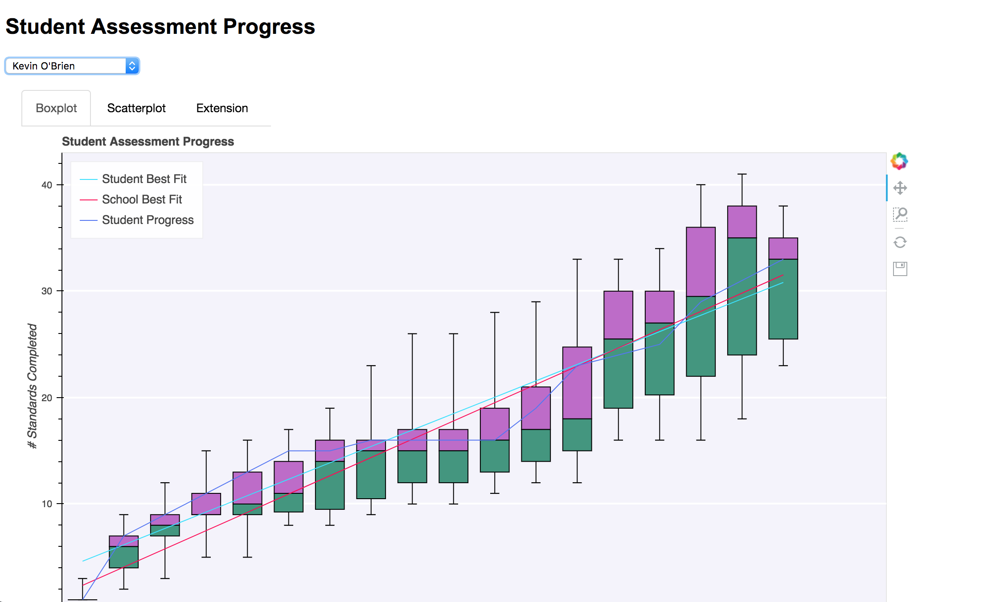

# Student Advancement Progress

https://student-assessment-progress.herokuapp.com/

Overall, we need to know how long it takes students to advance through the standards. Given a cohort start date and end date, we know that it's not linear- the back half of the program moves much quicker than the front half... but _how much_ quicker?

## Tasks

- [x] job number one is plotting that curve- % through the program on the x axis, number of standards (in order) completed on the Y
As a stretch, taking a median average is OK, but what I'd _really_ like to see is the distribution at each point. What's the density of students who have completed 5 standards at 10% through the program? 7 standards? 0 standards?

- [x] job number two is being to plot a particular student's progress *against* that line
what was the path they took, and are they current above the median or below the median? How far above and below?

- [x] job number three is being able to adjust the end date for a student and repaint their curve accordingly
we want to be able to play with the end date to see if that puts them above the curve, so we can better calculate extensions

## V2

- App pulls drill submissions from API rather than local file
  - remove local file
  - have client request data
  - display proper loading message
  - refactor server to use data from client (not local file)
  - create cache
  - allow for reload
- Start and end date are now accurate from API 
  - use data from api
  - display start and end date for student
  - modify url to display selected student
    - change when dropdown is selected
    - load when a student is selected
- Line size incremented
- Date picker added to predict student progress
  - modify request to include an end date
  - if sent, display new line with modified date
  - depricate extension tab
- Create release notes

